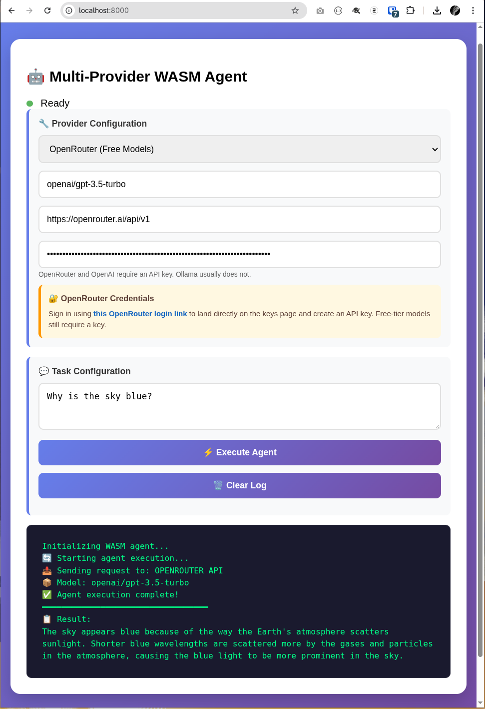

# WASM LLM Agent Demo

A WebAssembly-based LLM agent that runs in the browser and can interact with various LLM providers.

## Features

- 🤖 Runs entirely in the browser using WebAssembly
- 🔄 Supports multiple LLM providers (OpenAI API, Ollama)
- 🛠️ Built-in tool calling (string length calculation)
- 🌐 Universal WASM binary for all platforms

## Screenshot



## Quick Start

1. **Install prerequisites:**
   ```bash
   # Install Rust
   curl --proto '=https' --tlsv1.2 -sSf https://sh.rustup.rs | sh
   source ~/.cargo/env

   # Add WASM target
   rustup target add wasm32-unknown-unknown

   # Install wasm-pack
   cargo install wasm-pack
   ```

2. **Build and package for distribution:**
   ```bash
   ./build.sh --package
   ```

3. **Open the viewer:**
   ```bash
   # Extract and run the packaged distribution
   unzip wasm-agent-viewer-*.zip
   cd wasm-agent-viewer-* && ./start-server.sh
   # Then open http://localhost:8000 in your browser
   ```

## Distribution

The project includes a complete packaging system for creating downloadable distributions:

### Creating a Distribution Package

```bash
# Build and package
./build.sh --package
```


This creates:
- **`wasm-agent-viewer-YYYYMMDD.zip`** - Cross-platform browser package
- **`wasm-agent-viewer-YYYYMMDD.tar.gz`** - Cross-platform browser package (if `zip` is unavailable, `tar.gz` is produced)

### Distribution Contents

The distribution package includes:
- **Web viewer** - `index.html`
- **WASM package** - `pkg/wasm_agent.js`, `pkg/wasm_agent_bg.wasm`, and `.d.ts` files
- **Server scripts** - `start-server.sh`, `start-server.bat`, `start-server.ps1`

### Running the Distribution

**Web Server Mode (Recommended):**
```bash
unzip wasm-agent-viewer-*.zip
cd wasm-agent-viewer-*
./start-server.sh  # Linux/macOS
# or
start-server.bat   # Windows
```

**Manual Serving:**
```bash
python3 -m http.server 8000
# Then open http://localhost:8000
```

### Testing on Android and iOS Devices (LAN Access)

To test the viewer on a physical Android or iOS device connected to the same Wi-Fi network:

1. **Start the server bound to all interfaces** so your phone can reach it:

   ```bash
   # Linux/macOS (from the extracted distribution folder)
   ./start-server.sh 8000 0.0.0.0

   # Windows PowerShell
   .\start-server.ps1 -Port 8000 -Bind 0.0.0.0

   # Windows cmd
   start-server.bat 8000 0.0.0.0
   ```

   The script will print your machine's LAN IP, for example:
   ```
   LAN access (Android/iOS): http://192.168.1.42:8000
   ```

2. **Open that URL on your device's browser** (Chrome on Android, Safari on iOS).

3. **Requirements on the device:**
   - A modern browser that supports WebAssembly (Chrome 57+, Safari 11+, Firefox 52+).
   - The viewer runs entirely in the browser — no app installation needed.
   - No special headers (COOP/COEP) are required because the WASM module does not use threads or SharedArrayBuffer.

4. **Firewall note:** Ensure port 8000 (or whichever port you chose) is not blocked by your OS firewall.
   - macOS: System Settings → Network → Firewall → allow incoming connections for Python.
   - Windows: Allow Python through Windows Defender Firewall when prompted.

> **iOS Safari note:** iOS Safari 11+ supports WebAssembly. If you see a blank page, check that you are using `http://` and not `file://`, and that JavaScript is enabled in Safari settings.

## Architecture

- `wasm-agent/` - Rust crate compiled to WebAssembly
- `index.html` - Web interface that loads and runs the WASM agent
- `build.sh` - Build script using wasm-pack

## Script Status

- Canonical build script: `build.sh` (use `--package` to create a distribution)
- Deprecated legacy bootstrap scripts: Removed

## Supported Providers

- **OpenAI API**: Compatible with OpenAI, Open WebUI, and similar services
- **Ollama**: Native Ollama API support

## Distribution Options

### Universal Browser Distribution
- **Universal compatibility** - Works in any modern web browser
- **Zero install runtime** - Just extract and serve over HTTP
- **Cross-platform** - Same package works on Windows, macOS, Linux

### Archive Downloads
- **ZIP format** - `wasm-agent-viewer-YYYYMMDD.zip`
- **TAR.GZ format** - `wasm-agent-viewer-YYYYMMDD.tar.gz`
- **Complete packages** - Include all necessary files and documentation

## Development

See [BUILD.md](BUILD.md) for detailed build instructions and architecture notes.

## CI/CD Workflows

The project includes GitHub Actions workflows for automated building and packaging:

### Automated Release Workflow (`build-and-release-viewer.yml`)

**Triggers:**
- Push to `main` branch (builds and tests)
- Tag push with `v*` pattern (creates GitHub release)
- Manual trigger with release type options

**Features:**
- ✅ Builds WASM module
- ✅ Creates complete distribution packages
- ✅ Tests the distribution (server startup, file verification)
- ✅ Creates GitHub releases with downloadable packages
- ✅ Supports nightly builds

### Manual Build Workflow (`manual-build-viewer.yml`)

**Triggers:**
- Manual workflow dispatch only

**Features:**
- ✅ Builds WASM module
- ✅ Creates distribution packages
- ✅ Optional artifact upload
- ✅ Quick testing without releases

### Cross-OS Validation Workflow (`build-viewer.yml`)

**Purpose:**
- Builds one canonical archive package
- Validates extraction and package structure on Linux/macOS/Windows
- Confirms one package is consumable across OS environments

### Using the Workflows

**Manual Build:**
1. Go to GitHub Actions tab
2. Select "Manual Build Viewer Packages"
3. Click "Run workflow"
4. Optionally enable artifact upload
5. Download artifacts from the workflow run

**Creating Releases:**
1. Use the release script: `./release.sh patch` (or `minor`/`major`)
2. Or manually: `git tag v1.0.0 && git push origin v1.0.0`
3. The workflow will automatically build, test, and create a GitHub release
4. Users can download the browser package archive from the release

**Nightly Builds:**
1. Go to Actions → "Build and Release Viewer Packages"
2. Click "Run workflow" and select `nightly` release type
3. Creates or updates a `nightly` release with latest code

## Build Environment Notes

- `wasm-pack` requires `cargo` to be available in `PATH`.
- If Rust is installed but `cargo` is missing, add:

```bash
export PATH="$HOME/.cargo/bin:$PATH"
```

## Git Ignore

- Root `.gitignore` now ignores generated release archives:
   - `wasm-agent-viewer-*.zip`